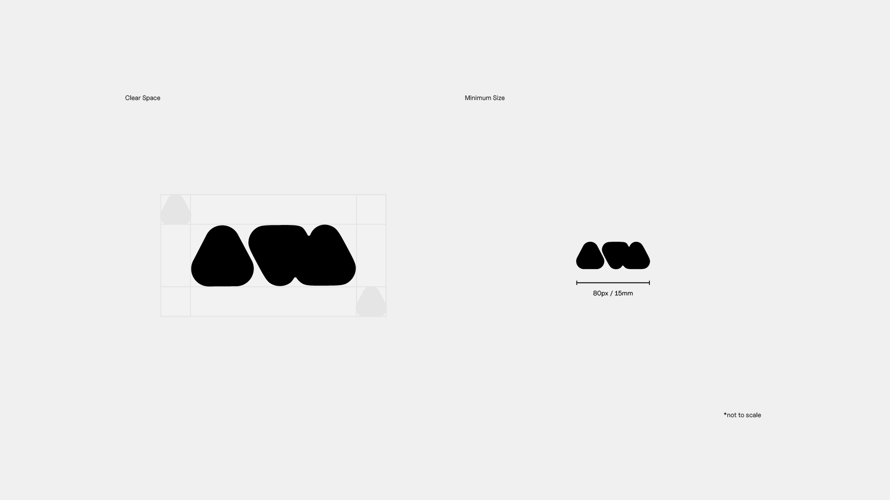
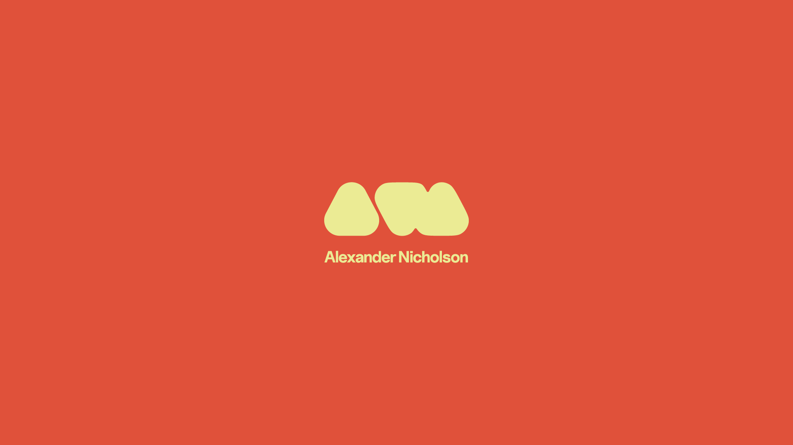
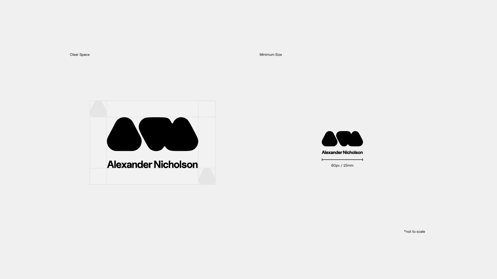
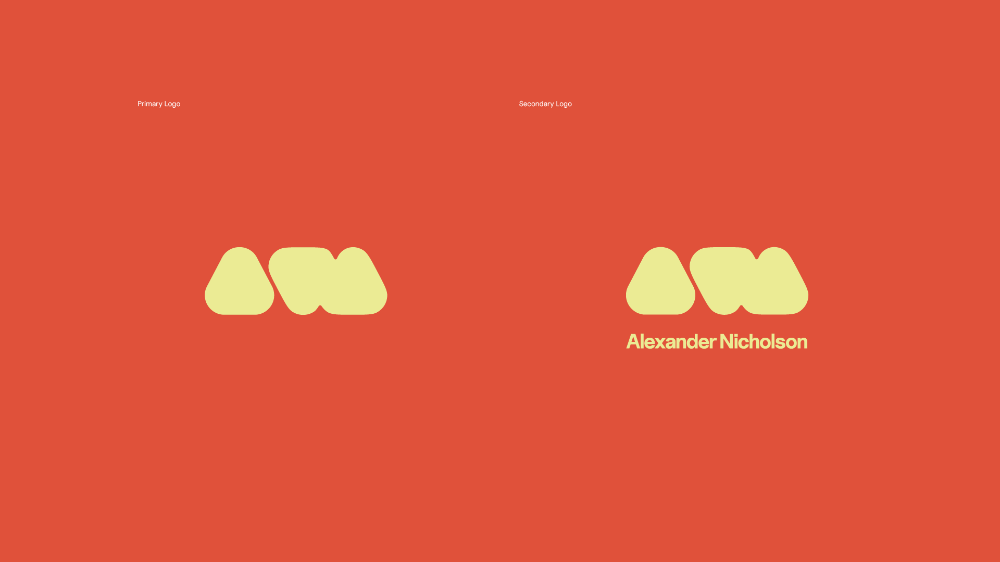
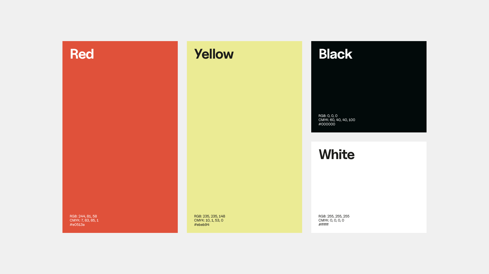
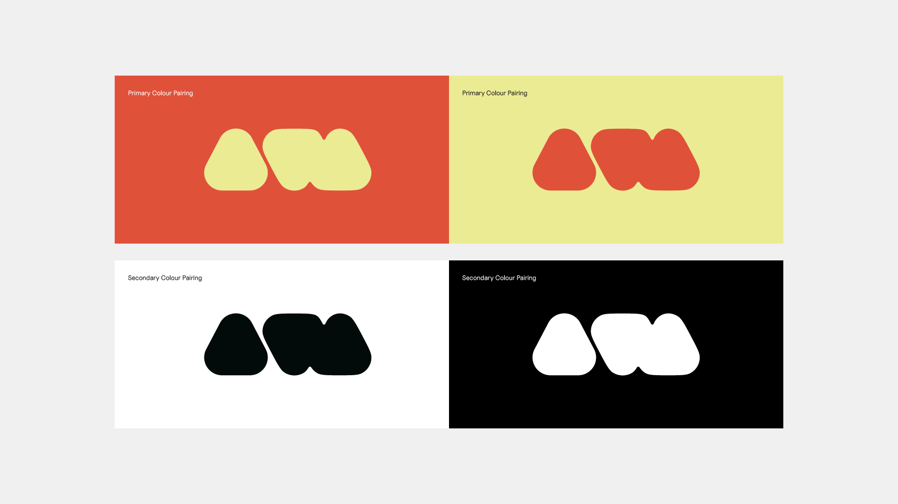
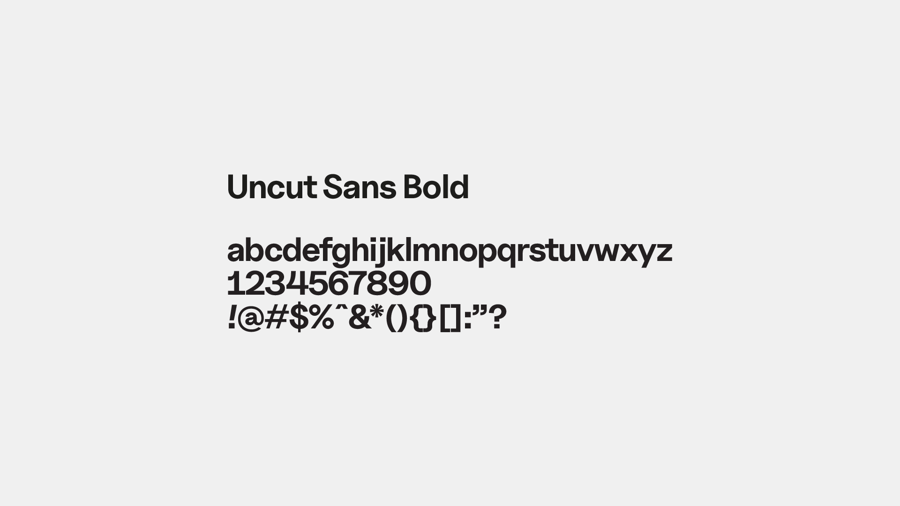
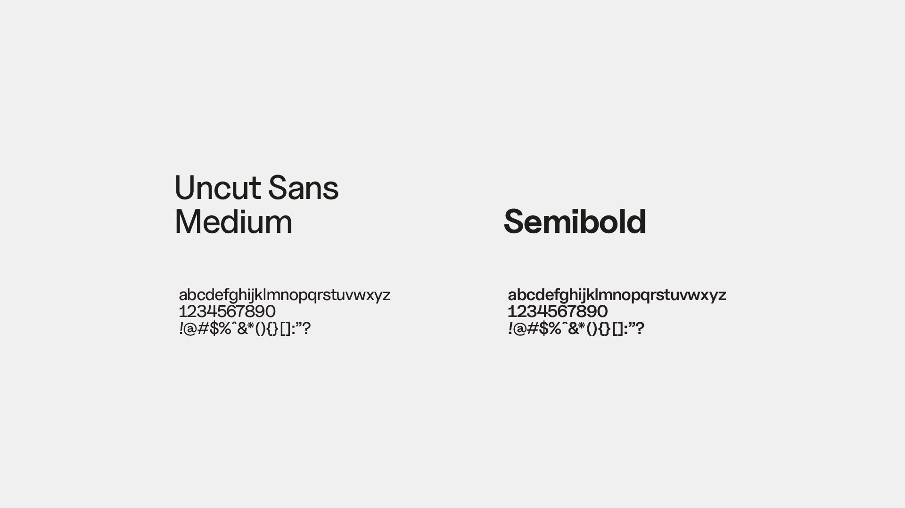
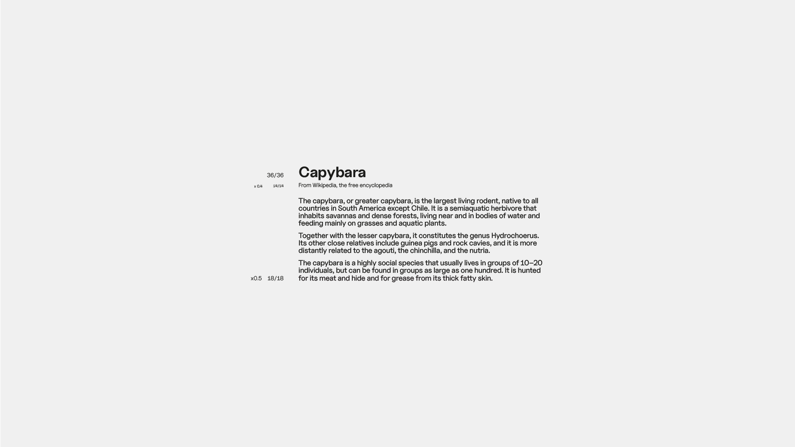
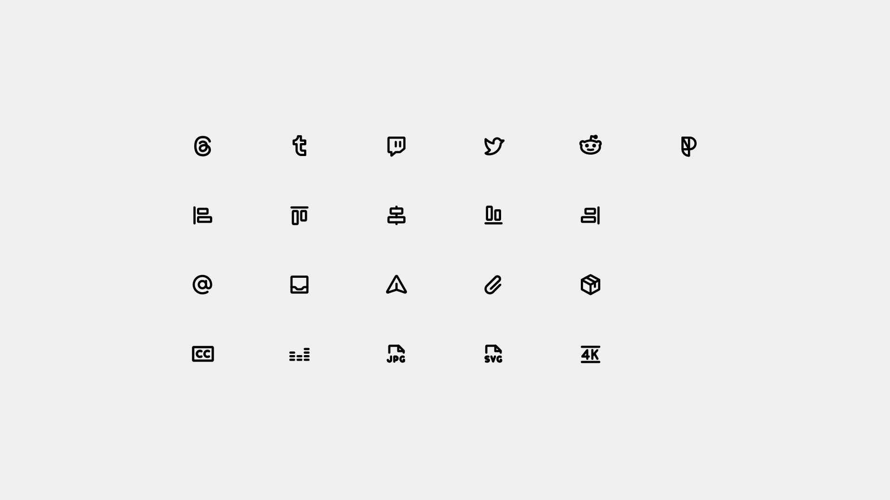

# AN Brand Guidelines

---

## Primary Logo

### The Logo 

The primary logo is the key visual element and main visual indicator for the brand. To maintain visual consistency between uses, it should not be altered in any way except the resizing of the mark, detailed later on.

### Clear Space & Minimum Size

The clear space of the logo refers to the minimum margin of space that should be kept around the logo to protect its form and recognition, and prevents the brand identity being compromised by other unrelated marks.
The clear space of the logo mark is equal to 0.5x the height of the ‘A’ glyph, and remains consistent around both the width and height of the bounds of the mark.

> Minimum size, print 15mm
> Minimum size, digital 80px

## Secondary Logo

### The Logo

Designed from a combination of the logo mark and word mark, the secondary logo is to be used in cases where a taller logo is preferred by the formatting of the media.

### Clear Space & Minimum Size

The dimensions of the clear space and minimum size of the secondary logo are the same as the primary logo.
The clear space of the secondary logo is equal to 0.5x the height of the ‘A’ glyph, and remains consistent around both the width and height of the bounds of the mark.

> Minimum size, print 15mm
> Minimum size, digital 80px

### Clear Space & Minimum Size

The dimensions of the clear space and minimum size of the secondary logo are the same as the primary logo.
The clear space of the secondary logo is equal to 0.5x the height of the ‘A’ glyph, and remains consistent around both the width and height of the bounds of the mark.

> Minimum size, print 15mm
> Minimum size, digital 80px

## Logo Usage

Depending on the aspect ratio, the primary and secondary logos may be used interchangeably. For horizontal media, the primary logo will be used, and for vertical or square media, the secondary logo will be used.
Although the aspect ratio of the media should be taken into account, there should also be a consideration taken to use the secondary logo if the media doesn’t include the ‘Alexander Nicholson’ name, regardless of aspect ratio.
The primary logo should always be used for social media icons and profile pictures, where the user name sits in close proximity.

---

## Colour

### The Colours

The main brand accent colours are red and
yellow, and should be used to add spice to the
white and black backgrounds. Black and White
text should be used only.

### Colour Usage

The primary colour scheme should be the red and yellow pairing to convey the brand colours, but where a monotone colour pairing is needed, black and white should be used.

---

## Typography

> Uncut Sans is included in this repo under the SIL Open Font License 1.1

### Headline Typography

Due to the versatility of Uncut Sans, it is used for both the headline and body typography for the brand. For headline uses, only the bold weight should be used.

### Body Typography

For body text, the medium weight should be used, along with semi-bold for important information. Subheadings should be set in the regular weight.

### Type Relationship

Optical kerning should be used in conjunction with a tracking value of -20 for all type. The exact size of type heavily relies on context and content, so the following should be used only as a guide:

> The recommended ratio of headline type size to body copy is 2:1.
 
>The recommended ratio of headline type to footnote type size is around 2.5:1, with the resulting point size being rounded down.

---

## Iconography

>Phosphor icons are included in this repo under the MIT license.

To keep the brand consistent across all platforms and endpoints, the recommended icon pack is the phosphor set of icons in bold.

---